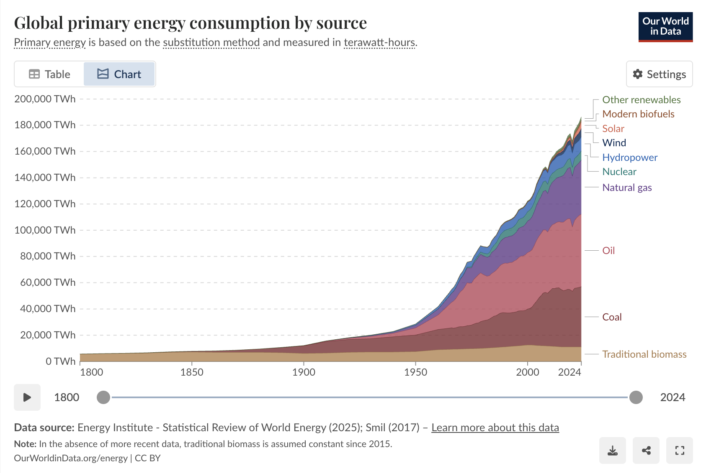
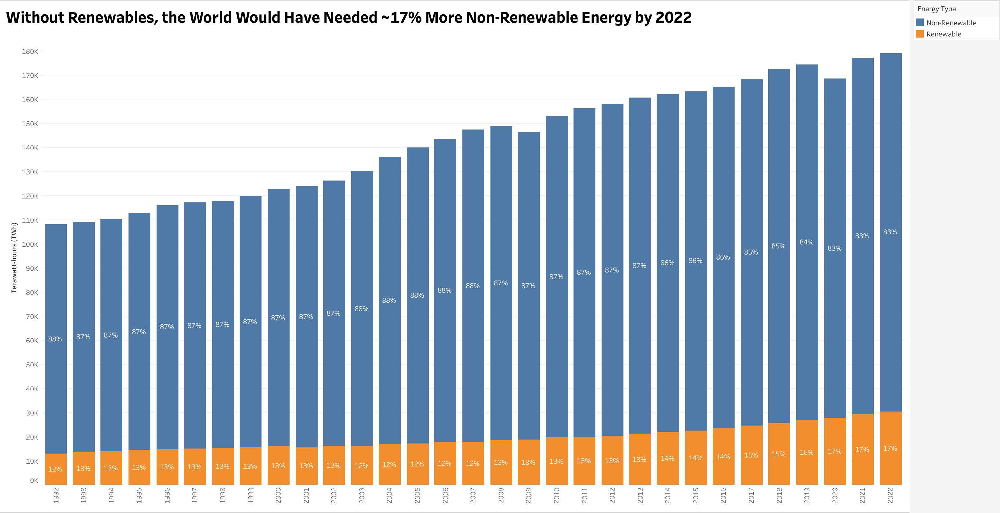
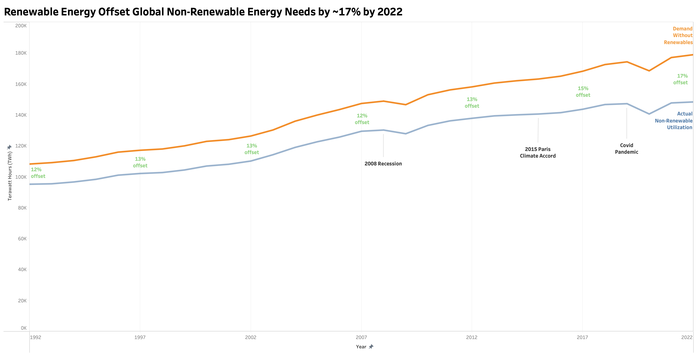

| [home page](https://sjudge-eng.github.io/TSWD-portfolio/) | [data viz examples](https://sjudge-eng.github.io/TSWD-portfolio/#portfolio) | [critique by design](critique-by-design) | [final project I](final-project-part-one) | [final project II](final-project-part-two) | [final project III](final-project-part-three) |

# Critique By Design

## Step one: the visualization

> Visualization by The Energy Institute from <a href="https://ourworldindata.org/energy-production-consumption#how-much-energy-does-the-world-consume">Our World in Data</a>

I landed on redesigning this visualization for one primary reason: Its initial design confused and frustrated me. What I thought was a very straightforward and seemingly simple (albeit busy) graphic turned out to be more and more nuanced with each pass of the original graphic. What I thought was a simple graphic showing world energy consumption of various energy forms (essentially renewable and non-renewable) turned out to be something a little more involved. This graphic, at its core, is trying to compare renewable and non-renewable energy sources in one fair way. The issue, and the root cause of the confusion, is that renewable energy is traditionally measured via output and non-renewable sources are traditionally measured via input energy. Why this can cause discrepancies is that roughly 60% of non-renewable input energy is traditionally lost in the form of heat when transforming from inputs to usable output energy. To combat this, when comparing renewable sources, it is customary to do what is called the <a href="https://ourworldindata.org/energy-substitution-method">'substitution method'</a> where the output energy of renewables sources is divided by a thermal efficiency factor (generally 0.4). What this number represents is the non-renewable energy we would need in order to create an identical amount of energy from non-renewable sources, instead of renewable. 

It was this deep learning curve that I had to go through just to understand what this graphic was actually saying that was deeply frustrating to me. I felt that there must be a simpler way to tell this story without requiring the reader to go through mathematical calculations and reading a separate webpage on the substitution method. As I would later find out, it is indeed very difficult to express this point in a meaningful manner.

## Step two: the critique
Below is a breakdown of the Google form that was completed with regard to the above visualization.

Usefulness: 5/10

Completeness: 8/10

Perceptibility: 2/10

Truthfulness: 8/10

Intuitiveness: 2/10

Aesthetics: 7/10

Engagement: 7/10

Observations:

Building on what was alluded to above, I thought this graphic was showing me a 1-to-1 of how much energy each energy type created for our current energy system by year. It took me a long time to really understand what this substitution method was doing, why it was so important, and how the graphic itself was actually much more misleading than I think the authors intended it to be. With that said, I would categorize that under what they did not do well. What they did do well was pulling in incredibly useful data, trying to present it in a manner (that once explained) helps to show the impact of renewables on our system and how much we still have left to go before they are truly making an impact on our current energy requirements. 

Primary Audience:

I did not find this explicitly clear, but because of the author's implementation of the substitution method and the rationale for such method, I believe that their targeted audience is policy makers. By using this graphic, one is able to make the case for how much fossil fuel energy is being displaced by renewables with their respective sources (wind/solar/hydro etc). I think, with that very narrow frame of who the audience is, and with the big assumption that policy makers inherently understand this substitution method, then I would say that it is pretty effective in reaching that audience. I would say this because it does two things somewhat well: it shows how much energy renewables are displacing from traditional fossil fuels (in the graphic, you can put your cursor on a particular year and get exact numeric data for each group type) and it shows the rapid expansion of fossil fuels over that same period of time. If policy makers were to be using the tool within that very narrow context, I do believe they could extract meaningful information from this graphic. If their target audience was anyone beyond this very specific group of policy makers looking for that exact type of data, I feel that they would miss the mark. Why I say this is for two reasons: The reader may come to think they understand the graphic and leave with this belief none-the-wiser on this substitution method OR, the reader may come to understand the substitution method and feel misled as to what it was they were reading. As I alluded to above, this method is being done for one very specific purpose (in my opinion), to show how much fossil fuel energy renewables are removing from the overall energy system. If a reader is to understand this graphic in any other way (say, they believe this substituted number represents the actual energy output by this renewable energy type), then they would be getting the wrong idea, potentially creating misinformed policy decisions, mistrust with readers, or general frustration in time wasted.

Redesign Focus:

My main focus on this redesign will be two fold: I really want to adjust the name of the visualization so that we can accurately convey what these renewable data points actually mean AND I am excited to reframe this in a more positive manner. What I mean by my second point is that I feel like we are missing an incredibly important point: That renewables are growing in the amount of fossil fuels they are displacing YoY. While fossil fuels are growing, there are a number of extraneous reasons behind this growth that the reader need not concern themselves with. I want to really hone in on the fact that renewables are having a positive impact on the reduction in greenhouse gases because of their relative growth in amount of fossil fuels no longer being used in the system. I feel like this is the main idea that is lost throughout reading and actually understanding this graphic and I am looking forward to trying to bring clarity and simplicity back to this visualization. 

## Step three: Sketch a solution

## Step four: Test the solution

Probing Questions: 

- Can you tell me what you believe you are looking at?

- What is it about this graphic that stands out to you?

- Who do you think is the intended audience for this?

- Is there anything you would change or do differently?

Results: 

Interview 1 Profile: Mechanical engineering PhD student

Interview 2 Profile: MISM-BIDA student

| Question | Interview 1 | Interview 2 |
|----------|-------------|-------------|
| Can you tell me what you believe you are looking at? | They understood the purpose of the graphic and the meaning it was attempting to convey. | They thought it was showing how much renewable energy is currently used in the world. |
| What is it about this graphic that stands out to you? | They noted general formatting difficulties, including seeing the percentage, identifying the year, and questioning whether the y-axis was useful. | The yellow bars at the bottom stood out, along with the overall growth of the bars. They found the percentages difficult to understand because the bars would get larger while the relative percentages stayed the same. |
| Who do you think is the intended audience for this? | They thought it was intended for academics or politicians. | They thought it was intended for people interested in energy-related topics. |
| Is there anything you would change or do differently? | They recommended adding important dates, de-emphasizing the current colors because the gold was very prominent, and potentially making the colors more opaque overall. They also recommended exploring different chart styles to see whether another would be better suited for this type of comparison. | They said the current chart type was confusing and recommended using a line graph instead. They also recommended removing the percentages because they found them confusing overall. |

Synthesis: 

Based on the information provided from the two interviews, the main point of confusion centered around the actual chart type chosen. Both interviewees felt that the chosen chart type made it difficult to read and they felt that the point could be presented in a cleaner format, potentially with a line graph. There was also talk about how the base meaning of what it was I was trying to convey (the positive impact of renewable energy sources) was being lost. One interviewee liked that you could see a trend of increasing energy usage, but that did not mean that a bar graph was still the proper chart type for conveying this information. After these discussions, I felt that I had enough to redesign my current implementation and make it a more clean, and cohesive visualization.

## Step five: build the solution

This final sketch design represents the integration of the in-class critique. After these discussions, I really aligned with the fact that not only was the base message I was wanting to convey being obfuscated, my utilization of color and chart type was muddying the water, so to speak. My redesign attempted to address these points of confusion while also holding true to what I felt was the base purpose of the chart in the first place: Showing the reduction in non-renewable energy needed due to renewable energy sources. In this final design, I really wanted to keep things simple. I felt that by cleaning up the graphic, and opening up more white space, it enabled the viewer to focus more in on the valuable data points that I chose to highlight: important dates (these were arbitrarily picked by me), renewable offset percentages, and the line key. Something else that was discussed in the interviews was that the YoY change in percentages between each data point (each data point represented a year) was not significant. In recognition of that, instead of having this %change in each year instance, I moved it to every five years showing the current %change. I felt this reduced load on the reader, while still helping to connect the meaning of these percentages to the meaning conveyed in the title. As I alluded to in the intro paragraph, it is quite difficult to account for this substitution method properly and convey to the reader simply what everything means. In recognition of that, this is my final attempt at putting together a clearer, simpler graphic that (in my opinion) still aligns with the overall purpose of the original graphic.

## References
<a href="https://ourworldindata.org/energy-substitution-method">Substitution method</a>

<a href="https://ourworldindata.org/energy-production-consumption#how-much-energy-does-the-world-consume">Our World in Data</a>

## AI acknowledgements
AI (ChatGPT) was used to help in the actual creation of the graphic. The specific areas that it helped in were almost entirely around formatting. These areas were adding in the text boxes for the percentage offsets, getting the label to properly display at the end of each line, and getting the three dates of interest ('08 financial crisis, paris accord, and covid) to properly display in the graphic. 

