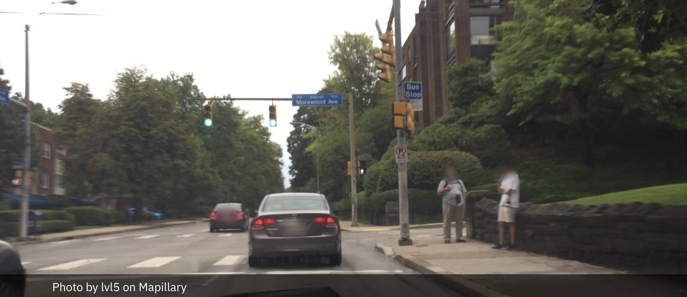
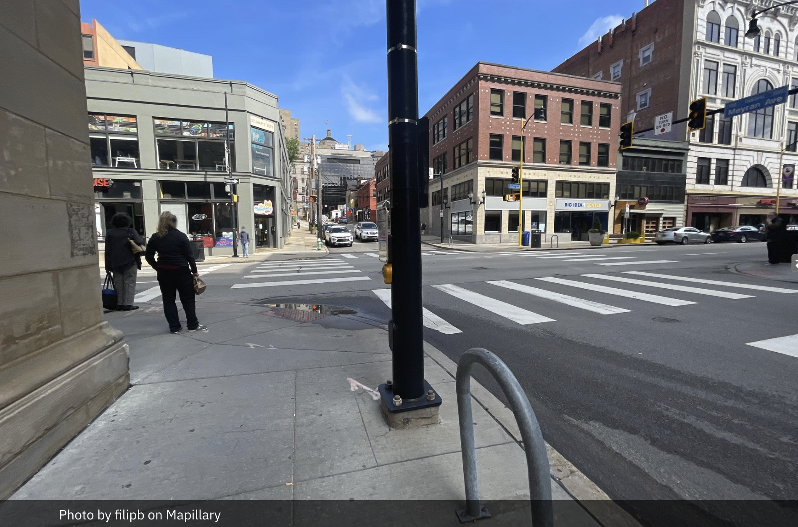
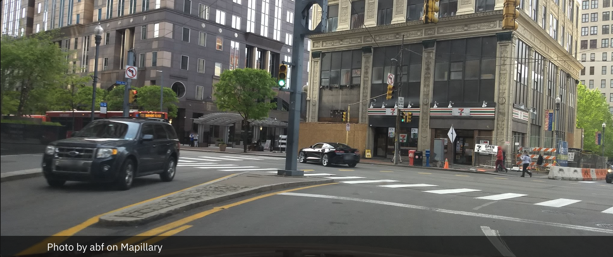

| [home page](https://sjudge-eng.github.io/TSWD-portfolio/) | [data viz examples](https://sjudge-eng.github.io/TSWD-portfolio/#portfolio) | [critique by design](critique-by-design) | [final project I](final-project-part-one) | [final project II](final-project-part-two) | [final project III](final-project-part-three) |

# The final data story
This project presents an interactive data story developed in Shorthand that examines pedestrian-involved crashes in Pittsburgh between 2020 and 2024. The story guides readers through a structured narrative beginning with the overall scale of the issue, highlighting 778 pedestrian-involved crashes recorded during the five-year period, and then moving into visualizations that show how these crashes are not evenly distributed across the city. Through hotspot mapping and location-specific case studies, the story focuses on several recurring intersections in downtown Pittsburgh and Oakland, where pedestrian activity, transit access, and high vehicle traffic intersect. A comparison with Bellevue, Washington, provides additional context to help readers unfamiliar with Pittsburgh understand how local risk compares to another city that the project creator has lived in. The story concludes by summarizing what the data suggests about recurring crash locations and highlighting Pittsburgh’s policy response through the Pedestrian Safety Action Plan (PSAP) and the city’s 2024 Vision Zero commitment, emphasizing how officials have begun targeting the streets and intersections where pedestrian risk is most concentrated as well as how these officials charaterize some of the causes of these crashes.

[External Link to Shorthand Presentation](https://carnegiemellon.shorthandstories.com/pedestrian-risks-on-pittsburgh-roads/index.html)

# Changes made since Part II
Since completing Part II, I revised the story to improve clarity, audience focus, and overall flow. I strengthened the Pittsburgh–Bellevue comparison, added more local context to the featured hotspots, refined the maps and graphics to reduce clutter, and expanded the city-response section to better connect the data to Pittsburgh’s Pedestrian Safety Action Plan and Vision Zero commitment. I also updated the closing sequence so it synthesizes the key findings and includes practical takeaways for both pedestrians and drivers. These changes made the final story more cohesive, easier to follow, and more clearly connected to the project’s central finding: pedestrian crash risk in Pittsburgh is concentrated in recurring, identifiable places.

## The audience
The primary audience identified for this data story is students, pedestrians, and daily commuters who regularly move through Pittsburgh’s downtown and Oakland corridors, particularly those who may not be fully aware of how pedestrian crash risk is concentrated in specific locations. This audience focus was informed by interview feedback from graduate students and a professional familiar with data visualization, all of whom emphasized the importance of making the visuals clear, relatable, and grounded in recognizable places. Based on these insights, several adjustments were made to improve accessibility and relevance for this audience, including adding local intersection details, incorporating street-level images and contextual landmarks, simplifying complex graphics such as the heatmap, and including a comparison city to help readers better understand the scale of the issue. The final presentation was also structured to move from broad patterns to familiar, place-based examples, making it easier for readers to connect the data to locations they may encounter in everyday life.

## Final design decisions
Several key design decisions were made throughout the development of this project to improve clarity, readability, and overall storytelling effectiveness. One of the most important decisions was to organize the story around a clear narrative progression, moving from the scale of the problem, to where crashes cluster, to why specific locations matter, and finally to how the city has responded. Visually, I chose to simplify complex graphics such as dense heatmaps by introducing grouped hotspot maps and focused intersection cards, which made it easier for readers to identify meaningful patterns without becoming overwhelmed. I also standardized the use of concise source lines instead of placing small citation numbers directly on graphics, improving visual cleanliness while maintaining credibility. Another key decision was to incorporate real-world images and localized details for each intersection, helping transform abstract data into recognizable places that readers could connect to.

## References
All citations are provided in-line throughout the Shorthand presentation. The only addition I am making to references are specific callouts for the images taken at the three intersections that were included in the presentation. References were listed on the images themselves, but upon publishing the story, these references did not stay on the image like the Unsplash ones do. To counter that, I am including specific references below, as well as including a reference mention in the Shorthand references page for each respective author of each image. 

Image Provided by lvl5 on Mapillary

Image Provided by filipb on Mapillary

Image Provided by abf on Mapillary

## AI acknowledgements
AI has been involved in the creation and design of this story from the beginning. AI  helped with idea generation, specifically at the very beginning on what story I might consider putting together and how I could, as a student, relate. AI also has been very helpful in getting the most out of Tableau, I do not have much experience with this tool so with AI I can tell it what image/visualization I want to express and AI instructs me on exactly what measures to put where. AI has also been very helpful in the obtaining of very niche information, specifically the WA Collision Analysis tool as well as some of the articles detailing the Mayor's words on pedestrian safety. Lastly, AI has been helpful in ensuring that I am actually creating a cohesive story from beginnig to end. I would detail the current structure and flow and AI would recommend additional considerations in the form of more narrative from officials, deeper comparisons to WA, and even helping to diagnose issues with data/Tableau connections.

# Final thoughts
Overall, this project was both challenging and rewarding, particularly in learning how to translate large datasets into a clear, meaningful narrative that readers could follow. One of the most valuable lessons from this process was realizing that effective data storytelling is not just about building accurate charts, but about refining structure, simplifying visuals, and repeatedly testing ideas with others to ensure the message is clear. If I had more time, I would further refine the hotspot visualizations and continue improving the comparison between cities to make it even easier for unfamiliar readers to interpret the differences and how these differences help to define the issue in Pittsburgh. I was most excited about seeing the project evolve from a collection of raw crash records into a cohesive story that connects data, geography, and public policy. This process helped me better understand how data visualization can be used not only to describe a problem, but also to highlight patterns that inform decision-making and public awareness.
